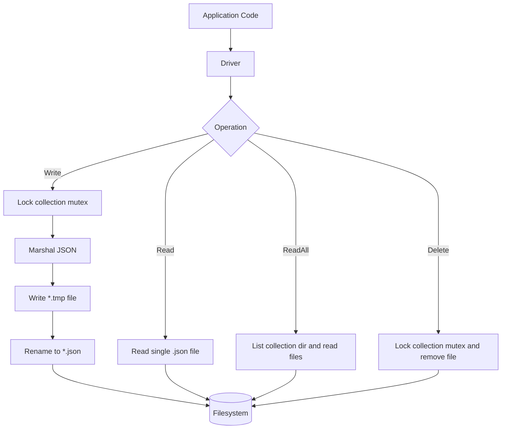
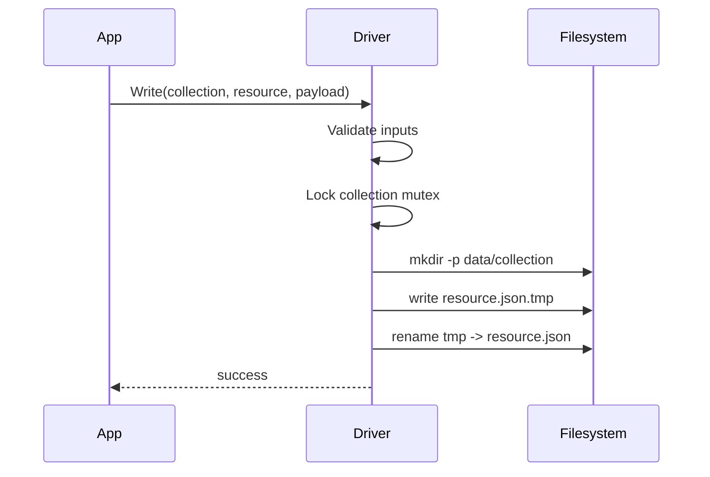

# Golang-Database

<p align="center">
	
</p>

<p align="center">
	<a href="https://github.com/maverick0721/Golang-Database">
		
	</a>
	<a href="https://github.com/maverick0721/Golang-Database/stargazers">
		
	</a>
	<a href="https://github.com/maverick0721/Golang-Database/issues">
		
	</a>
	
	
	
	
</p>

<p align="center">
	Lightweight JSON file database engine in Go for local-first apps, tools, and prototypes.
</p>

## Table of Contents

- [Overview](#overview)
- [Project Status](#project-status)
- [Highlights](#highlights)
- [Quick Start](#quick-start)
- [CLI Commands](#cli-commands)
- [Architecture](#architecture)
- [Write Flow (Atomic)](#write-flow-atomic)
- [Data Layout](#data-layout)
- [Demo Output](#demo-output)
- [API Snapshot](#api-snapshot)
- [Usage Example](#usage-example)
- [Testing](#testing)
- [Changelog](#changelog)
- [Roadmap](#roadmap)
- [Contributing](#contributing)
- [Notes](#notes)

## Overview

This project stores records as JSON files on disk, uses temp-file rename for safer writes, and protects writes/deletes with per-collection mutexes.

It is intentionally simple and easy to inspect, making it a good fit for:

- local tools and CLI prototypes
- educational projects
- lightweight persistence where running a full DB server is unnecessary

## Project Status

- Current scope: single-process, file-based JSON storage
- Verified locally with tests and demo run
- API surface is stable for core operations (`Write`, `Read`, `ReadAll`, `Delete`)

## Highlights

- Zero external database setup
- Atomic file writes (`.tmp` -> `.json`)
- Collection-scoped locking for concurrency safety
- CRUD-style operations (`Write`, `Read`, `ReadAll`, `Delete`)
- Simple API for local tools, demos, and small apps

## Quick Start

```bash
go mod tidy
go test ./...
go run .
```

## CLI Commands

```bash
# Run demo program
go run .

# Build
go build ./...

# Run tests
go test ./...
```

## Architecture



## Write Flow (Atomic)



## Data Layout

After running the demo, records are stored like:

```text
data/
  users/
	Aman.json
	Manav.json
	Priyanshu.json
	Shailendra.json
	Siddharth.json
	Yash.json
```

## Demo Output

Sample output from `go run .`:

```text
[{
	"Name": "Aman",
	"Age": 21,
	"Contact": "0987651111",
	"Company": "Apple",
	"Address": {
		"City": "Gwalior",
		"State": "Madhya Pradesh",
		"Country": "India",
		"Pincode": 474011
	}
}
 ...
]
[{Aman 21 0987651111 Apple {Gwalior Madhya Pradesh India 474011}} ...]
```

## API Snapshot

Core methods:

```go
Write(collection, resource string, v interface{}) error
Read(collection, resource string, v interface{}) error
ReadAll(collection string) ([]string, error)
Delete(collection, resource string) error
```

## Usage Example

This project is currently a `main` package, so usage is demonstrated in `main.go`.

```go
db, err := New("./data", nil)
if err != nil {
	panic(err)
}

u := User{Name: "Alice", Age: "21", Contact: "9999999999", Company: "ExampleCo"}

if err := db.Write("users", u.Name, u); err != nil {
	panic(err)
}

var out User
if err := db.Read("users", "Alice", &out); err != nil {
	panic(err)
}

records, err := db.ReadAll("users")
if err != nil {
	panic(err)
}

_ = records
```

## Testing

Automated tests currently cover:

- Write/Read round-trip
- ReadAll returns all records
- Delete removes records
- Validation for empty collection/resource inputs

Run tests:

```bash
go test ./...
```

## Changelog

Release notes are tracked in [CHANGELOG.md](CHANGELOG.md).

## Roadmap

- Add benchmarks for write/read/delete throughput
- Add package split (`driver` package) for easier import into other projects
- Optional indexing layer for faster lookups in larger collections
- Better error taxonomy with sentinel errors

## Contributing

Contributions are welcome.

1. Fork the repository
2. Create a feature branch
3. Add or update tests
4. Run `go test ./...`
5. Open a pull request with a clear summary

## Notes

- Recommended for lightweight/local persistence use cases.
- Not intended as a replacement for full production RDBMS/NoSQL systems.
